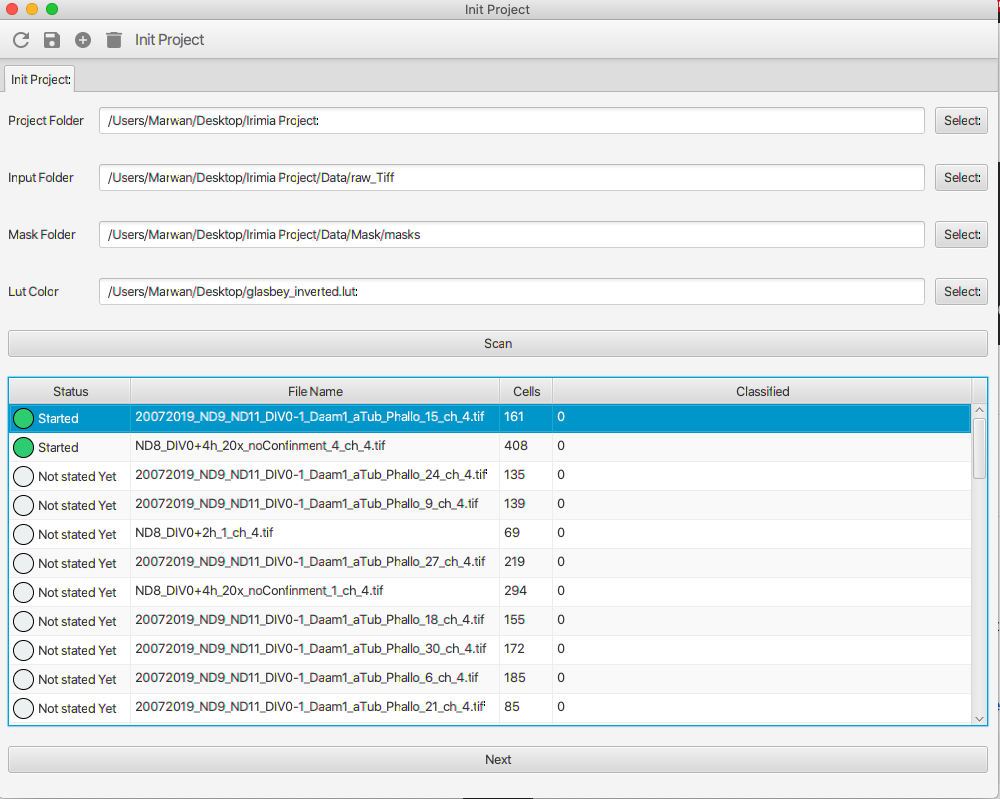

# PINNA-2D
PINNA 2D - Pixel-wIse NeuroN Annotation


## Installation
Go to [release page](https://github.com/PreibischLab/PINNA-2D/releases/tag/0.1): 

Ubuntu: download [Pinna_unix_0_1.sh](https://github.com/PreibischLab/PINNA-2D/releases/download/0.1/Pinna_unix_0_1.sh), install and run

Mac: download [Pinna_macos_0_1.dmg](https://github.com/PreibischLab/PINNA-2D/releases/download/0.1/Pinna_macos_0_1.dmg), and run the dmg directly

or

Download the JAR download [PINNA-2D-0.1-jar-with-dependencies.jar](https://github.com/PreibischLab/PINNA-2D/releases/download/0.1/PINNA-2D-0.1.jar)  and run 
```bash
java - jar PINNA-2D-0.1-jar-with-dependencies.jar
```

if you get javafx not found related bug
install Javafx in ubuntu by:
```bash
sudo apt install openjfx
```


## Usage
### Initiate Project

#### 1- Specify the project folder: 

Everything related to the project will be saved there. ( The database, the CSV statistic of cells with space dims, the instance classification images ).

#### 2- Specify the RAW tiff folder: 

The folder where there are the tiff files.

#### 3- Specify the Masks tiff folder: 

The folder where there are the masks files. You can download them from [masks.zip](https://github.com/PreibischLab/PINNA-2D/releases/download/0.1/masks.zip)

#### 4- Specify the LUT file: 

The LUT is the file used to color the cells in the view. You can download them from [glasbey_inverted.lut](https://github.com/PreibischLab/PINNA-2D/releases/download/0.1/glasbey_inverted.lut)


#### 5- Start the process: 

Click SCAN to detect all the files. if everything is ok, select the file you want to analyze and click Next.

### Classify the cells 


You have just to select the cell you want to annotate from the list or from the image.
Then you select the right category.
After annotating the full image, you can export the statistic as CSV and the image of the classification.
The image will be used to train the model.


## Contributing
Pull requests are welcome. For major changes, please open an issue first to discuss what you would like to change.

Please make sure to update the tests as appropriate.
